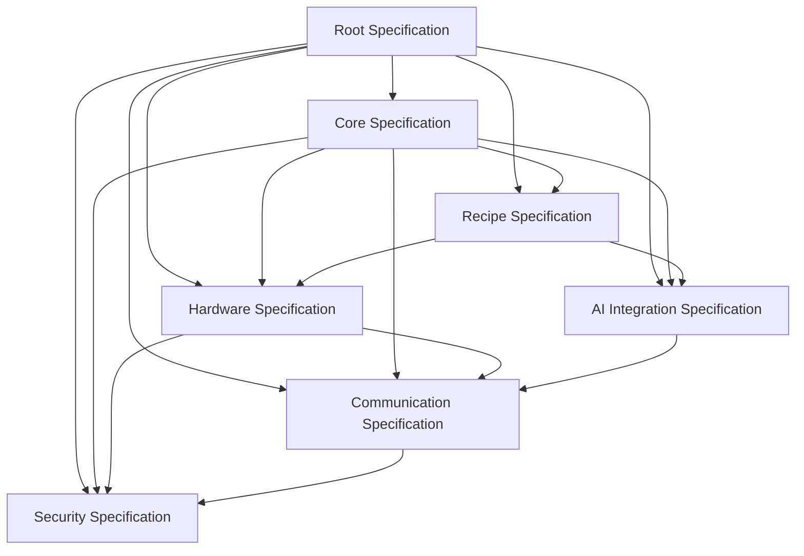
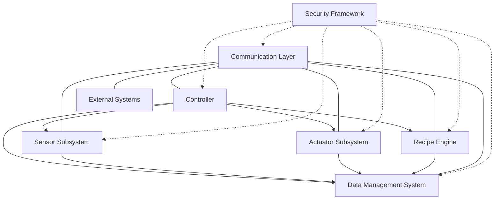
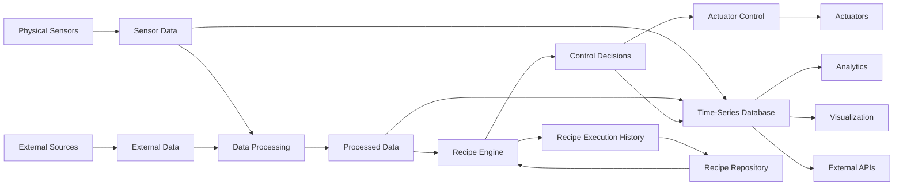
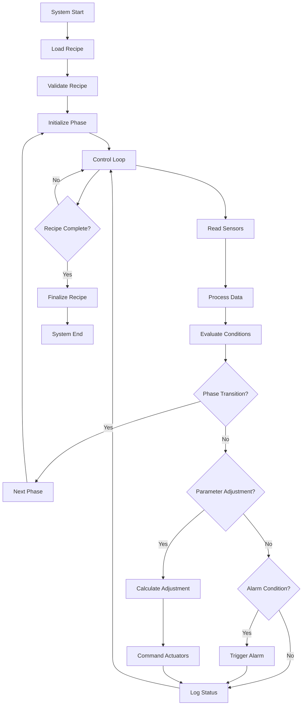

# OGP Core Specification (v2.0)

*This document is part of the OGP 2.0 specification suite. For the overarching vision, motivation, and community-driven approach, please refer to the [Root Specification](../ogp-root-spec.md).*

**Version:** 2.0.0  
**Date:** March 19, 2025  
**Status:** Proposed Standard  
**Authors:** Open Growing Alliance  

## 1. Introduction

### 1.1 Purpose and Scope

This Core Specification defines the technical architecture and implementation requirements of the Open Growing Protocol (OGP). It serves as the technical foundation that unifies all domain-specific specifications and provides a comprehensive framework for implementing interoperable growing systems.

The scope of this document includes:
- Defining the core technical architecture of OGP-compliant systems
- Establishing the technical relationships between all domain specifications
- Providing detailed technical guidance for implementers
- Specifying the minimum requirements for OGP compliance
- Outlining the extension mechanisms for future capabilities

This specification is intended for hardware manufacturers, software developers, system integrators, and other technical stakeholders implementing OGP-compliant systems.

### 1.2 Key Concepts

The OGP is built on several fundamental concepts that enable interoperability, extensibility, and security across implementations:

**Interoperability**: The ability for components from different manufacturers to work together seamlessly. This is achieved through standardized interfaces, data formats, and communication protocols. Interoperability is the cornerstone of the OGP, enabling recipe portability and component substitutability.

**Extensibility**: The capacity for the protocol to accommodate new capabilities, technologies, and use cases without breaking existing implementations. Extensibility is built into the OGP through modular design, versioned interfaces, and explicit extension points.

**Security by Design**: Security is integrated into every aspect of the OGP, not added as an afterthought. This includes authentication, authorization, data protection, and secure communication channels. The security model is designed to protect both the growing system and the data it generates.

**Progressive Enhancement**: Basic functionality works everywhere, with enhanced capabilities available where supported. This allows for implementations at various resource levels while maintaining compatibility.

**Declarative Approach**: Recipes describe what to achieve, not how to achieve it, allowing for implementation flexibility across different hardware configurations.

### 1.3 Relationship to Domain Specifications

The Core Specification serves as the technical foundation for all domain-specific specifications. It defines the common architecture, data models, and interaction patterns that enable the domains to work together as a cohesive system.

The relationship between the Core Specification and domain specifications is illustrated in the following diagram:

Each specification has clear dependencies and relationships with others, creating a cohesive whole while maintaining modularity.

- **Recipe Specification**: Defines the format and structure for growing recipes, depending on hardware capabilities and potentially AI features.
- **Hardware Specification**: Details the hardware abstraction layer, relying on communication protocols and security measures.
- **Communication Specification**: Specifies the communication standards and protocols, with security considerations.
- **AI Integration Specification**: Outlines the AI model interfaces and capabilities, utilizing communication protocols.
- **Security Specification**: Provides security standards and best practices that apply across all domains.

Implementers must adhere to both the Core Specification and the relevant domain specifications for their specific implementation.

### 1.4 Versioning and Compatibility

The OGP follows semantic versioning (MAJOR.MINOR.PATCH) with the following guidelines:

- **MAJOR** version changes indicate incompatible API changes
- **MINOR** version changes add functionality in a backward-compatible manner
- **PATCH** version changes make backward-compatible bug fixes

The Core Specification and each domain specification are versioned independently, allowing for different evolution rates while maintaining overall coherence.

**Backward Compatibility Requirements:**

1. New MINOR versions MUST be backward compatible with previous MINOR versions of the same MAJOR version.
2. Implementations MUST clearly indicate their supported specification versions.
3. Features marked as "deprecated" MAY be removed in the next MAJOR version.
4. Implementations SHOULD support at least the current and previous MAJOR versions.

**Version Discovery:**

Systems MUST provide a version discovery endpoint that returns:
- Supported specification versions (Core and domain-specific)
- Implementation-specific version information
- Capability matrix indicating supported optional features
- Deprecation notices for features scheduled for removal

This versioning strategy ensures that implementations can evolve while maintaining compatibility with existing systems and recipes.

## 2. Architecture Overview

### 2.1 System Components

The OGP architecture consists of several core components that work together to create a complete growing system:

**Controller**: The central orchestration component that manages the overall system operation. The controller:
- Interprets and executes recipes
- Manages sensors and actuators
- Processes data and makes decisions
- Handles communication with external systems
- Implements security policies

**Sensor Subsystem**: Collects environmental and plant data. This includes:
- Physical sensors (temperature, humidity, light, etc.)
- Virtual sensors (derived from physical sensor data)
- AI-enhanced sensors (using machine learning for advanced insights)
- External data sources (weather forecasts, etc.)

**Actuator Subsystem**: Modifies the growing environment based on controller commands. This includes:
- Environmental control (HVAC, lighting, CO2, etc.)
- Nutrient delivery systems
- Mechanical systems (pruning, harvesting, etc.)
- Notification systems (alerts, warnings, etc.)

**Recipe Engine**: Processes and executes growing recipes. The recipe engine:
- Validates recipe syntax and semantics
- Schedules phase transitions and actions
- Monitors compliance with recipe parameters
- Adapts to environmental conditions within recipe constraints
- Records execution history and outcomes

**Data Management System**: Handles data collection, storage, and analysis. This includes:
- Time-series data storage
- Recipe and configuration storage
- Historical performance analysis
- Data export and sharing capabilities
- Privacy and security controls

**Communication Layer**: Enables interaction between components and external systems. This includes:
- Internal communication between subsystems
- External APIs for management and integration
- Data streaming for monitoring and analysis
- Secure communication channels

**Security Framework**: Provides security services across all components. This includes:
- Authentication and authorization
- Data encryption and integrity
- Secure boot and runtime verification
- Vulnerability management
- Audit logging and monitoring

The following diagram illustrates the relationships between these components:

### 2.2 Data Flow Diagram

The OGP data flow illustrates how information moves through the system:

Key data flows include:

1. **Sensor Data Collection**: Raw data from physical sensors and external sources is collected and timestamped.
2. **Data Processing**: Raw data is processed, validated, and transformed into meaningful metrics.
3. **Decision Making**: The recipe engine evaluates processed data against recipe requirements to make control decisions.
4. **Actuation**: Control decisions are translated into specific commands for actuators.
5. **Data Storage**: All data is stored in a time-series database for historical analysis and reporting.
6. **External Access**: Data is made available to external systems through APIs and visualization tools.
7. **Recipe Management**: Recipes are retrieved from repositories, executed, and execution history is recorded.

### 2.3 Control Flow Diagram

The control flow illustrates the decision-making and command execution process:

Key control flows include:

1. **Recipe Initialization**: Loading and validating the recipe, then initializing the first phase.
2. **Control Loop**: The continuous cycle of reading sensors, processing data, evaluating conditions, and taking actions.
3. **Decision Points**: Key decision points include phase transitions, parameter adjustments, and alarm conditions.
4. **Actuation**: Calculating and issuing commands to actuators based on decision outcomes.
5. **Logging**: Recording system status and actions for historical analysis.
6. **Termination**: Finalizing the recipe when complete or when terminated by external command.

### 2.4 Security Model

The OGP security model follows a defense-in-depth approach, implementing security at multiple layers:

**Authentication and Identity Management**:
- All system access requires authentication
- Support for multiple authentication methods (passwords, certificates, tokens, etc.)
- Identity federation for enterprise environments
- Device identity for hardware components

**Authorization and Access Control**:
- Role-based access control (RBAC) for all operations
- Attribute-based access control (ABAC) for fine-grained permissions
- Least privilege principle for all components
- Separation of duties for critical operations

**Data Protection**:
- Encryption of sensitive data at rest and in transit
- Data integrity verification
- Secure key management
- Data minimization and privacy controls

**Communication Security**:
- TLS 1.3 or later for all network communications
- Certificate validation and pinning
- Secure protocols for all interfaces
- Network segmentation and filtering

**System Integrity**:
- Secure boot for hardware components
- Runtime integrity verification
- Signed firmware and software updates
- Tamper detection mechanisms

**Operational Security**:
- Comprehensive logging and monitoring
- Intrusion detection and prevention
- Vulnerability management
- Incident response procedures

The security model is implemented across all system components and interfaces, with specific requirements detailed in the Security Specification.

## 3. Core Specifications

### 3.1 AI Integration

The OGP Core Specification defines the foundational requirements for AI integration, with detailed implementation guidance provided in the AI Integration Specification.

**AI Capability Categories**:

1. **Environmental Monitoring**: AI models that analyze sensor data to detect patterns, anomalies, and trends.
   - Plant health assessment
   - Growth rate analysis
   - Environmental condition optimization
   - Anomaly detection and diagnosis

2. **Predictive Analytics**: AI models that forecast future conditions and outcomes.
   - Yield prediction
   - Resource consumption forecasting
   - Maintenance scheduling
   - Harvest timing optimization

3. **Autonomous Control**: AI models that make or recommend control decisions.
   - Environmental parameter adjustment
   - Resource allocation optimization
   - Adaptive recipe modification
   - Intervention recommendation

4. **Computer Vision**: AI models that analyze visual data.
   - Plant identification
   - Growth stage detection
   - Pest and disease identification
   - Quality assessment

**Core AI Requirements**:

1. **Model Interfaces**: All AI models MUST implement standardized interfaces for:
   - Input data formats and schemas
   - Output data formats and schemas
   - Confidence scoring
   - Explainability data
   - Version and capability advertisement

2. **Confidence Scoring**: All AI outputs MUST include confidence scores that:
   - Range from 0.0 (lowest confidence) to 1.0 (highest confidence)
   - Are calibrated to reflect actual accuracy
   - Are accompanied by confidence thresholds for actions
   - Can be used for decision weighting

3. **Explainability**: AI models SHOULD provide explainability data that:
   - Identifies key factors influencing the output
   - Quantifies the relative importance of each factor
   - Links to relevant historical data
   - Is accessible through standard interfaces

4. **Versioning**: AI models MUST implement semantic versioning and provide:
   - Clear version identification
   - Compatibility information
   - Performance metrics
   - Training dataset characteristics

5. **Fallback Mechanisms**: Systems using AI MUST implement fallback mechanisms that:
   - Detect AI failures or low confidence
   - Provide alternative decision paths
   - Notify operators when appropriate
   - Gracefully degrade functionality

The AI Integration Specification provides detailed implementation guidance for these requirements.

### 3.2 Communication Protocols

The OGP Core Specification defines the foundational requirements for communication protocols, with detailed implementation guidance provided in the Communication Protocol Specification.

**Communication Domains**:

1. **Internal Communication**: Communication between components within a single growing system.
   - Sensor data collection
   - Actuator control
   - Inter-component coordination
   - Local user interfaces

2. **System-to-System Communication**: Communication between multiple growing systems.
   - Recipe sharing
   - Data synchronization
   - Coordinated growing
   - Resource sharing

3. **External Integration**: Communication with external systems and services.
   - Cloud services integration
   - Enterprise system integration
   - Third-party applications
   - Data export and analysis

**Core Communication Requirements**:

1. **Protocol Support**: Systems MUST support at least one of the following protocols for each communication pattern:
   - **Command/Response**: HTTP/2, gRPC, or MQTT 5.0
   - **Publish/Subscribe**: MQTT 5.0 or WebSockets
   - **Request/Stream**: WebSockets, Server-Sent Events, or gRPC streams

2. **Data Formats**: Systems MUST support the following data formats:
   - JSON for configuration and metadata
   - Protocol Buffers or MessagePack for high-performance data
   - CBOR for resource-constrained environments

3. **API Documentation**: All APIs MUST be documented using:
   - OpenAPI 3.1 for HTTP APIs
   - AsyncAPI 2.0 for event-driven APIs
   - Protocol Buffers IDL for gRPC APIs

4. **Security**: All communication MUST implement:
   - TLS 1.3 or later for encryption
   - Certificate validation
   - Authentication for all non-public endpoints
   - Authorization for all operations

5. **Discovery**: Systems MUST implement discovery mechanisms that:
   - Advertise available endpoints and capabilities
   - Support dynamic configuration
   - Enable zero-configuration setup where possible
   - Provide fallback manual configuration options

The Communication Protocol Specification provides detailed implementation guidance for these requirements.

### 3.3 Hardware Requirements

The OGP Core Specification defines the foundational requirements for hardware integration, with detailed implementation guidance provided in the Hardware Abstraction Specification.

**Hardware Categories**:

1. **Sensors**: Devices that measure environmental conditions and plant status.
   - Environmental sensors (temperature, humidity, light, etc.)
   - Substrate sensors (moisture, pH, EC, etc.)
   - Plant monitoring sensors (weight, size, color, etc.)
   - Resource monitoring sensors (water level, nutrient levels, etc.)

2. **Actuators**: Devices that modify the growing environment.
   - Environmental control (HVAC, lighting, CO2, etc.)
   - Irrigation and nutrient delivery
   - Mechanical systems (pruning, harvesting, etc.)
   - Alert and notification systems

3. **Controllers**: Devices that manage the growing system.
   - Central control units
   - Edge controllers
   - Sensor hubs
   - User interface devices

4. **Infrastructure**: Supporting hardware components.
   - Power management
   - Network infrastructure
   - Physical structure
   - Safety systems

**Core Hardware Requirements**:

1. **Hardware Abstraction Layer (HAL)**: All hardware MUST implement a HAL that:
   - Provides standardized interfaces for sensors and actuators
   - Abstracts hardware-specific details
   - Enables hardware substitution without recipe modification
   - Supports capability advertisement

2. **Capability Advertisement**: Hardware MUST advertise its capabilities including:
   - Sensor types and specifications
   - Actuator types and specifications
   - Measurement ranges and accuracy
   - Control ranges and precision
   - Update frequencies and latencies

3. **Calibration**: Sensor systems MUST support:
   - Initial calibration procedures
   - Calibration verification
   - Recalibration scheduling
   - Calibration data storage and retrieval

4. **Fault Tolerance**: Hardware systems MUST implement:
   - Fault detection mechanisms
   - Graceful degradation
   - Failure notification
   - Recovery procedures

5. **Resource Management**: Hardware systems MUST implement:
   - Power management
   - Resource monitoring
   - Resource optimization
   - Maintenance scheduling

The Hardware Abstraction Specification provides detailed implementation guidance for these requirements.

### 3.4 Recipe Representation

The OGP Core Specification defines the foundational requirements for recipe representation, with detailed implementation guidance provided in the Recipe Representation Specification.

**Recipe Components**:

1. **Metadata**: Information about the recipe itself.
   - Identification (ID, name, description)
   - Versioning (semantic version)
   - Authorship and licensing
   - Provenance and modification history
   - Categorization and tagging

2. **Plant Information**: Details about the plant being grown.
   - Species and variety
   - Expected growth characteristics
   - Special requirements
   - Harvesting criteria
   - Expected outcomes

3. **Phases**: Distinct stages in the growing process.
   - Germination/propagation
   - Vegetative growth
   - Flowering/fruiting
   - Ripening/maturation
   - Harvesting

4. **Parameters**: Environmental conditions to maintain.
   - Temperature (day/night, min/max)
   - Humidity (day/night, min/max)
   - Light (intensity, spectrum, photoperiod)
   - Air (CO2, circulation)
   - Water (irrigation frequency, volume)
   - Nutrients (composition, concentration, pH, EC)

5. **Events**: Scheduled or conditional actions.
   - Phase transitions
   - Nutrient changes
   - Training and pruning
   - Pest management
   - Harvest timing

6. **Adaptations**: Rules for adjusting parameters based on conditions.
   - Environmental response rules
   - Growth stage adaptations
   - Stress response strategies
   - Resource optimization rules

**Core Recipe Requirements**:

1. **Format**: Recipes MUST be represented in one of the following formats:
   - YAML (preferred for human readability)
   - JSON (preferred for machine processing)
   - XML (for legacy system compatibility)

2. **Schema Validation**: Recipes MUST validate against the OGP Recipe Schema, which:
   - Defines the structure and data types
   - Enforces required fields and relationships
   - Validates value ranges and constraints
   - Supports extensions through defined mechanisms

3. **Versioning**: Recipes MUST implement semantic versioning and include:
   - Recipe version (MAJOR.MINOR.PATCH)
   - Minimum OGP version required
   - Hardware capability requirements
   - Backward compatibility information

4. **Portability**: Recipes MUST be portable across compatible systems by:
   - Using abstract hardware capabilities instead of specific devices
   - Providing fallback options for optional capabilities
   - Including calibration references
   - Supporting capability negotiation

5. **Security**: Recipe security MUST be maintained through:
   - Digital signatures for authenticity
   - Access control for sensitive recipes
   - Validation before execution
   - Secure distribution mechanisms

The Recipe Representation Specification provides detailed implementation guidance for these requirements.

### 3.5 Security Framework

The OGP Core Specification defines the foundational requirements for security, with detailed implementation guidance provided in the Security Specification.

**Security Domains**:

1. **System Security**: Protecting the growing system itself.
   - Hardware security
   - Software security
   - Network security
   - Physical security

2. **Data Security**: Protecting the data generated and used by the system.
   - Data confidentiality
   - Data integrity
   - Data availability
   - Data privacy

3. **Access Security**: Controlling who can access the system and what they can do.
   - Authentication
   - Authorization
   - Accounting
   - Access control

4. **Communication Security**: Securing data in transit.
   - Encryption
   - Authentication
   - Integrity verification
   - Secure protocols

**Core Security Requirements**:

1. **Authentication**: Systems MUST implement authentication that:
   - Supports multiple authentication methods
   - Enforces strong credential policies
   - Implements account lockout protection
   - Provides audit logging of authentication events

2. **Authorization**: Systems MUST implement authorization that:
   - Enforces role-based access control
   - Applies least privilege principles
   - Supports fine-grained permissions
   - Validates all access attempts

3. **Data Protection**: Systems MUST protect data through:
   - Encryption of sensitive data at rest
   - Secure key management
   - Data integrity verification
   - Secure backup and recovery

4. **Communication Security**: Systems MUST secure communications by:
   - Using TLS 1.3 or later for all network traffic
   - Validating certificates
   - Implementing secure protocols
   - Protecting against network-based attacks

5. **Vulnerability Management**: Systems MUST implement:
   - Regular security updates
   - Vulnerability assessment
   - Secure configuration management
   - Security monitoring and alerting

The Security Specification provides detailed implementation guidance for these requirements.

## 4. Implementation Guidelines

### 4.1 Reference Implementations

The OGP provides reference implementations to demonstrate the protocol in action and provide implementation guidance:

**Core Reference Implementation**:
- GitHub Repository: https://github.com/opengrowingalliance/reference-ogp
- Documentation: https://docs.opengrowingtrust.org/reference-implementation
- License: Apache 2.0

The reference implementation includes:
- Complete implementation of all core specifications
- Example recipes and configurations
- Testing and validation tools
- Documentation and tutorials

**Domain-Specific Implementations**:
- Recipe Engine: https://github.com/opengrowingtrust/recipe-engine
- Hardware Abstraction Layer: https://github.com/opengrowingtrust/hal
- Communication Framework: https://github.com/opengrowingtrust/comm-framework
- AI Integration Toolkit: https://github.com/opengrowingtrust/ai-toolkit
- Security Framework: https://github.com/opengrowingtrust/security-framework

These implementations are designed to be:
- Educational resources for implementers
- Starting points for custom implementations
- Testing and validation references
- Examples of best practices

Implementers are encouraged to:
- Study the reference implementations
- Contribute improvements and extensions
- Report issues and suggest enhancements
- Share their own implementations and experiences

### 4.2 Compliance Requirements

To be considered OGP-compliant, implementations must meet the following requirements:

**Core Compliance**:
1. Implement all MUST requirements in the Core Specification
2. Pass the Core Compliance Test Suite
3. Provide a Compliance Statement documenting:
   - Implemented specifications and versions
   - Supported optional features
   - Implementation-specific extensions
   - Any areas of non-compliance with explanations

**Domain Compliance**:
1. Implement all MUST requirements in the relevant domain specifications
2. Pass the domain-specific Compliance Test Suites
3. Provide domain-specific Compliance Statements

**Compliance Levels**:
- **Level 1 (Basic)**: Implements core recipe execution with manual operation
- **Level 2 (Standard)**: Adds automated environmental control and basic data collection
- **Level 3 (Advanced)**: Adds AI integration and advanced automation
- **Level 4 (Complete)**: Implements all specifications including optional features

**Compliance Testing**:
- Self-assessment using the OGP Compliance Test Suite
- Third-party validation for certification
- Community review and feedback
- Continuous compliance monitoring for long-term support

The OGP Compliance Test Suite is available at: https://github.com/opengrowingtrust/compliance-tests

### 4.3 Certification Process

The OGP Certification Process provides formal validation of compliance:

**Certification Types**:
1. **Self-Certification**: Implementers test their own systems and publish results
2. **Community Certification**: Peer review by the OGP community
3. **Formal Certification**: Official certification by the Open Growing Alliance

**Certification Process**:
1. **Preparation**: Implement OGP specifications and conduct self-testing
2. **Documentation**: Prepare compliance documentation and test results
3. **Submission**: Submit implementation for certification review
4. **Validation**: Undergo testing and validation by certification authority
5. **Certification**: Receive certification and listing in the certified products directory
6. **Maintenance**: Maintain compliance through updates and periodic re-certification

**Certification Benefits**:
- Official recognition of compliance
- Listing in the OGP Certified Products Directory
- Use of the OGP Certification Mark
- Increased user confidence and market visibility
- Simplified integration with other certified products

**Certification Resources**:
- Certification Guidelines: https://opengrowingtrust.org/certification
- Certification Application: https://opengrowingtrust.org/certification/apply
- Certified Products Directory: https://opengrowingtrust.org/certified

### 4.4 Testing and Validation

The OGP provides a comprehensive testing and validation framework:

**Testing Categories**:
1. **Functional Testing**: Verifies that implementations meet functional requirements
2. **Interoperability Testing**: Ensures compatibility between different implementations
3. **Performance Testing**: Measures system performance under various conditions
4. **Security Testing**: Validates security controls and identifies vulnerabilities
5. **Compliance Testing**: Verifies adherence to OGP specifications

**Testing Tools**:
- OGP Test Suite: https://github.com/opengrowingtrust/test-suite
- Interoperability Test Harness: https://github.com/opengrowingtrust/interop-tester
- Performance Benchmarking Tools: https://github.com/opengrowingtrust/perf-tools
- Security Assessment Framework: https://github.com/opengrowingtrust/security-tester
- Compliance Validation Tools: https://github.com/opengrowingtrust/compliance-validator

**Validation Methodologies**:
1. **Unit Testing**: Testing individual components in isolation
2. **Integration Testing**: Testing component interactions
3. **System Testing**: Testing the complete system
4. **Acceptance Testing**: Validating against user requirements
5. **Regression Testing**: Ensuring changes don't break existing functionality

**Continuous Validation**:
- Automated testing in CI/CD pipelines
- Regular compliance checks
- Community-driven testing events
- Vulnerability scanning and security testing
- Performance monitoring and benchmarking

Implementers are encouraged to:
- Integrate testing throughout the development process
- Contribute test cases and improvements to testing tools
- Participate in community testing events
- Share testing results and experiences

## 5. Governance

### 5.1 Specification Maintenance

The OGP Core Specification is maintained through a structured governance process:

**Maintenance Responsibilities**:
- **Core Working Group**: Responsible for the Core Specification
- **Domain Working Groups**: Responsible for domain-specific specifications
- **Technical Steering Committee**: Provides oversight and coordination
- **Community Council**: Represents stakeholder interests

**Maintenance Activities**:
1. **Bug Fixes**: Correcting errors and inconsistencies
2. **Clarifications**: Improving clarity and resolving ambiguities
3. **Extensions**: Adding new capabilities and features
4. **Deprecations**: Marking features for future removal
5. **Major Revisions**: Significant changes requiring a new major version

**Maintenance Schedule**:
- **Patch Releases**: As needed for bug fixes and clarifications
- **Minor Releases**: Scheduled quarterly for extensions and improvements
- **Major Releases**: Scheduled annually for significant changes

**Maintenance Process**:
1. **Issue Tracking**: All maintenance items are tracked in the issue tracker
2. **Discussion**: Open discussion of proposed changes
3. **Review**: Formal review by the appropriate working group
4. **Approval**: Final approval by the Technical Steering Committee
5. **Publication**: Release of updated specifications
6. **Notification**: Communication to the community

**Maintenance Resources**:
- Issue Tracker: https://github.com/opengrowingtrust/specifications/issues
- Discussion Forum: https://forum.opengrowingtrust.org/specifications
- Change Log: https://opengrowingtrust.org/specifications/changelog
- Roadmap: https://opengrowingtrust.org/specifications/roadmap

### 5.2 Contribution Process

The OGP welcomes contributions from the community:

**Contribution Types**:
1. **Bug Reports**: Identifying errors or inconsistencies
2. **Feature Requests**: Suggesting new capabilities
3. **Clarification Requests**: Asking for improved explanations
4. **Specification Changes**: Proposing specific changes to the text
5. **Implementation Feedback**: Sharing experiences and challenges

**Contribution Process**:
1. **Issue Creation**: Create an issue in the tracker describing the contribution
2. **Discussion**: Engage in community discussion about the issue
3. **Proposal**: Develop a formal proposal if appropriate
4. **Review**: Submit the proposal for review by the appropriate working group
5. **Revision**: Revise the proposal based on feedback
6. **Approval**: Seek final approval from the Technical Steering Committee
7. **Integration**: Incorporate approved changes into the specification

**Contribution Guidelines**:
- Follow the OGP Contribution Guidelines
- Use the provided templates for different contribution types
- Engage constructively with feedback and discussion
- Respect the consensus-based decision process
- Consider backward compatibility implications

**Contribution Resources**:
- Contribution Guidelines: https://opengrowingtrust.org/contribute
- Issue Templates: https://github.com/opengrowingtrust/specifications/issues/templates
- Proposal Templates: https://github.com/opengrowingtrust/specifications/proposals/templates
- Contributor Agreement: https://opengrowingtrust.org/contribute/agreement

### 5.3 Versioning Policy

The OGP follows a structured versioning policy:

**Versioning Scheme**:
- **MAJOR**: Incompatible changes that require implementation updates
- **MINOR**: New features that maintain backward compatibility
- **PATCH**: Bug fixes and clarifications that maintain backward compatibility

**Version Lifecycle**:
1. **Draft**: Initial development version, subject to significant changes
2. **Proposed Standard**: Stable version ready for implementation
3. **Standard**: Widely implemented and validated version
4. **Deprecated**: Version scheduled for removal in a future MAJOR release
5. **Retired**: Version no longer supported

**Version Transition Rules**:
1. Draft versions MAY change without notice
2. Proposed Standard versions MUST maintain backward compatibility for MINOR and PATCH changes
3. Standard versions MUST maintain backward compatibility for MINOR and PATCH changes
4. Deprecated versions MUST be supported for at least one MAJOR version cycle
5. Retired versions MAY be removed from reference implementations

**Version Documentation**:
- Each version MUST be clearly documented
- Changes between versions MUST be documented in a changelog
- Migration guides MUST be provided for MAJOR version changes
- Deprecation notices MUST include migration guidance

### 5.4 Deprecation Process

The OGP follows a structured deprecation process to ensure smooth transitions:

**Deprecation Stages**:
1. **Announcement**: Feature is marked as deprecated but fully functional
2. **Warning**: Runtime warnings are issued when deprecated features are used
3. **Removal**: Feature is removed in a MAJOR version update

**Deprecation Timeline**:
- Features MUST be deprecated for at least one MINOR version before removal
- Deprecated features MUST be documented in the specification
- Implementations MUST provide warnings when deprecated features are used
- Removal MUST only occur in MAJOR version updates

**Deprecation Documentation**:
- Clear explanation of why the feature is being deprecated
- Recommended alternatives or migration paths
- Timeline for warning implementation and eventual removal
- Impact assessment for different types of implementations

**Backward Compatibility**:
- Deprecated features MUST continue to function until removal
- New features SHOULD NOT depend on deprecated features
- Migration tools SHOULD be provided where appropriate
- Compatibility layers MAY be provided to ease transition

## 6. Appendices

### 6.1 Glossary

**Actuator**: A device that modifies the growing environment based on control signals.

**AI Model**: A machine learning model that provides analysis, prediction, or control capabilities.

**Capability**: A specific function or feature that a system or component can perform.

**Controller**: The system component that orchestrates the operation of a growing system.

**Growing Recipe**: A complete set of instructions for growing a specific plant from start to finish.

**Hardware Abstraction Layer (HAL)**: A software layer that abstracts hardware-specific details to enable portability.

**Parameter**: A specific environmental condition (temperature, humidity, etc.) that affects plant growth.

**Phase**: A distinct stage in a plant's growth cycle with specific environmental requirements.

**Sensor**: A device that measures environmental conditions or plant status.

**Virtual Sensor**: A derived sensor that calculates values based on data from physical sensors or other sources.

### 6.2 References

**Normative References**:

1. YAML 1.2 Specification, https://yaml.org/spec/1.2/spec.html
2. JSON Schema Draft 2020-12, https://json-schema.org/specification.html
3. Semantic Versioning 2.0.0, https://semver.org/
4. RFC 7519: JSON Web Token (JWT), https://tools.ietf.org/html/rfc7519
5. RFC 8446: TLS 1.3, https://tools.ietf.org/html/rfc8446
6. MQTT Version 5.0, https://docs.oasis-open.org/mqtt/mqtt/v5.0/mqtt-v5.0.html
7. HTTP/2, RFC 7540, https://tools.ietf.org/html/rfc7540
8. WebSockets Protocol, RFC 6455, https://tools.ietf.org/html/rfc6455

**Informative References**:

1. W3C Web of Things (WoT) Architecture, https://www.w3.org/TR/wot-architecture/
2. OpenAPI Specification 3.1, https://spec.openapis.org/oas/v3.1.0
3. AsyncAPI Specification 2.0, https://www.asyncapi.com/docs/specifications/2.0.0
4. Protocol Buffers, https://developers.google.com/protocol-buffers
5. CBOR, RFC 8949, https://tools.ietf.org/html
