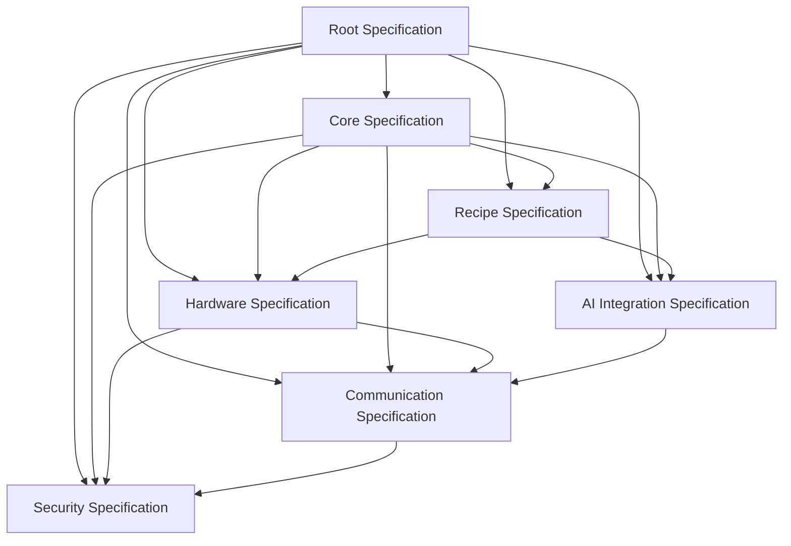

# OGSP Root Specification

**Version:** 2.0.0  
**Date:** March 19, 2025  
**Status:** Proposed Standard  
**Authors:** Open Growing Alliance  

## Abstract

This document serves as the root specification for the Open Growing System Protocol (OGSP), a standardized protocol for autonomous plant cultivation systems. It provides the overarching vision, motivation, and community-driven approach that unifies all modular specifications. OGSP enables interoperability between growing hardware, software, AI models, and recipe definitions, allowing for community-driven innovation while maintaining compatibility across implementations.

## Status of This Document

This document is a draft of a proposed industry standard. Distribution of this document is unlimited.

## Table of Contents

1. [Introduction](#1-introduction)
2. [Motivation and Design Philosophy](#2-motivation-and-design-philosophy)
3. [Community-Driven Approach](#3-community-driven-approach)
4. [Ecosystem Vision](#4-ecosystem-vision)
5. [Specification Architecture](#5-specification-architecture)
6. [Future Roadmap](#6-future-roadmap)
7. [Getting Started](#7-getting-started)
8. [References](#8-references)
9. [Appendices](#9-appendices)

## 1. Introduction

### 1.1 Purpose of This Document

This root specification serves as the foundational document that ties together all OGSP specifications. While the modular specifications provide detailed technical requirements for specific domains, this document establishes the overarching vision, principles, and architecture that unify the protocol. It explains the relationships between specifications and provides context for understanding the OGSP ecosystem as a whole.

### 1.2 OGSP Vision

The Open Growing System Protocol envisions a world where advanced plant cultivation technology is accessible to everyone, from commercial growers to hobbyists and researchers. By creating open standards for growing systems, OGSP aims to:

- **Democratize Access**: Make advanced growing techniques available to growers of all skill levels and resource capabilities
- **Enable Innovation**: Create a foundation for community-driven innovation in plant cultivation
- **Break Down Silos**: Eliminate proprietary barriers that prevent interoperability between systems
- **Foster Knowledge Sharing**: Create mechanisms for growers to share and improve cultivation methodologies
- **Accelerate Advancement**: Speed the development of more efficient, sustainable growing practices through collaborative improvement

OGSP represents a fundamental shift from closed, proprietary growing systems to an open ecosystem where components can be mixed and matched, recipes can be shared and improved, and innovation can flourish through community collaboration.

### 1.3 History and Evolution

The OGSP began as a response to the fragmentation in the growing system market, where proprietary technologies created barriers to innovation and knowledge sharing. The initial v1.0 specification established the core concepts and requirements, while v1.1 expanded on these with more detailed implementation guidance.

Version 2.0 represents a significant evolution in the OGSP approach, adopting a modular specification structure that allows for more focused development in specific domains while maintaining overall coherence. This modularization enables:

- More rapid evolution of individual components
- Clearer separation of concerns
- Easier implementation of specific capabilities
- More targeted contribution from domain experts
- Better adaptability to emerging technologies

The transition to a modular approach reflects the maturing of the OGSP ecosystem and the growing diversity of its applications and implementations.

## 2. Motivation and Design Philosophy

### 2.1 Problem Statement

Current plant cultivation systems suffer from several critical limitations:

- **Proprietary Formats**: Vendor-specific data formats and interfaces lock users into specific ecosystems, limiting choice and increasing costs
- **Lack of Interoperability**: Components from different manufacturers cannot easily work together, forcing all-or-nothing purchasing decisions
- **Knowledge Silos**: Growing methodologies remain trapped in closed systems, preventing community improvement
- **Limited AI Integration**: Artificial intelligence capabilities are not standardized, making it difficult to leverage advances in this rapidly evolving field
- **Accessibility Barriers**: Advanced growing techniques remain inaccessible to many due to cost, complexity, and proprietary knowledge

These limitations slow innovation, increase costs, and prevent the democratization of advanced growing techniques that could address food security, sustainability, and research needs worldwide.

### 2.2 Design Goals

The OGSP aims to address these challenges through the following design goals:

1. **Enable Recipe Portability**: Allow growing recipes to be shared and used across compatible hardware systems
2. **Create an Interoperable Ecosystem**: Foster development of interoperable sensors, actuators, controllers, and AI models
3. **Facilitate Community Knowledge Sharing**: Create mechanisms for growers to share and improve methodologies
4. **Support Progressive Automation**: Enable systems that can evolve from manual to assisted to fully autonomous growing
5. **Establish Clear Versioning**: Provide backward compatibility guidelines to protect investments in compatible systems
6. **Enable Hardware-Agnostic Development**: Allow recipes to be developed independently of specific hardware implementations
7. **Provide Secure Sharing Mechanisms**: Ensure privacy, security, and attribution in community sharing
8. **Support Diverse Growing Applications**: Accommodate a wide range of plant types, environments, and methodologies

### 2.3 Guiding Principles

The development and implementation of OGSP is guided by these core principles:

- **Openness and Transparency**: All specifications are openly available, and development processes are transparent
- **Simplicity and Usability**: Specifications prioritize ease of understanding and implementation
- **Security by Design**: Security considerations are integrated from the beginning, not added as an afterthought
- **Progressive Enhancement**: Basic functionality works everywhere, with enhanced capabilities where available
- **Graceful Degradation**: Systems should function reasonably even when optimal conditions or components are unavailable
- **Declarative Over Imperative**: Recipes describe what to achieve, not how to achieve it, allowing for implementation flexibility
- **Community Governance**: The protocol evolves through community-driven processes with clear governance structures
- **Inclusivity**: The protocol accommodates diverse needs, from hobbyists to commercial operations

## 3. Community-Driven Approach

### 3.1 Community Governance Model

OGSP is governed by a community-driven model that balances openness with structured decision-making:

- **Core Working Group**: Responsible for overall protocol direction and cross-domain coordination
- **Domain Working Groups**: Focus on specific technical domains (hardware, recipes, AI, etc.)
- **Community Council**: Represents diverse stakeholder interests in governance decisions
- **Technical Steering Committee**: Makes final decisions on technical specifications

All governance processes operate with maximum transparency, with discussions, decisions, and rationales publicly documented. The governance model is designed to:

- Ensure technical excellence
- Represent diverse stakeholder interests
- Prevent capture by any single entity or interest
- Enable rapid innovation while maintaining stability
- Provide clear paths for community participation

### 3.2 Contribution Framework

OGSP welcomes contributions from individuals and organizations across the ecosystem:

- **Code Contributions**: Reference implementations, testing tools, and utilities
- **Documentation**: Specifications, guides, tutorials, and translations
- **Testing and Validation**: Test suites, conformance testing, and bug reports
- **Use Cases and Requirements**: Real-world needs and application scenarios
- **Outreach and Education**: Community building and educational resources

The contribution process is designed to be accessible to newcomers while maintaining high quality standards. All contributions are recognized and attributed appropriately, building a community of recognized experts and contributors.

### 3.3 Knowledge Sharing

A core goal of OGSP is to enable knowledge sharing among growers and researchers:

- **Recipe Repositories**: Community repositories for sharing and discovering growing recipes
- **Methodology Documentation**: Standardized formats for documenting growing methodologies
- **Data Collection and Analysis**: Frameworks for collecting, analyzing, and sharing growing data
- **Educational Resources**: Tutorials, guides, and courses on OGSP implementation and use
- **Research Integration**: Mechanisms for integrating academic and commercial research

These knowledge sharing mechanisms are designed to accelerate innovation and improvement in growing methodologies, making advanced techniques accessible to all.

### 3.4 Democratization Strategy

OGSP is committed to democratizing access to advanced growing technology through:

- **Accessibility Considerations**: Ensuring specifications can be implemented at various resource levels
- **Tiered Implementation Levels**: Defining implementation levels from basic to advanced
- **Educational Outreach**: Programs to build capacity in underserved communities
- **Open Source Tools**: Free and open source tools for implementation and testing
- **Multilingual Resources**: Documentation and resources in multiple languages
- **Appropriate Technology Approaches**: Adaptations for diverse environmental and resource contexts

The democratization strategy ensures that OGSP benefits are accessible to diverse communities worldwide, not just well-resourced commercial operations.

## 4. Ecosystem Vision

### 4.1 Stakeholder Ecosystem

OGSP envisions a vibrant ecosystem with diverse stakeholders:

- **Hardware Manufacturers**: Creating compatible sensors, actuators, and integrated systems
- **Software Developers**: Building control systems, user interfaces, and data analysis tools
- **AI Researchers**: Developing models for plant monitoring, diagnosis, and optimization
- **Growers and Farmers**: Using OGSP systems for commercial and personal cultivation
- **Research Institutions**: Advancing plant science and cultivation techniques
- **Educators**: Teaching cultivation techniques and system development
- **Community Organizations**: Implementing growing projects for food security and sustainability

Each stakeholder group both contributes to and benefits from the OGSP ecosystem, creating a virtuous cycle of improvement and innovation.

### 4.2 Use Cases

OGSP supports a wide range of use cases across different contexts:

- **Commercial Agriculture**: Large-scale food production with optimized resource use
- **Urban Farming**: Space-efficient growing in urban environments
- **Research Applications**: Controlled experiments and phenotyping
- **Home and Hobby Growing**: Personal food production and ornamental plants
- **Educational Settings**: Teaching biology, technology, and sustainable agriculture
- **Community Gardens**: Shared growing spaces with collaborative management
- **Therapeutic Horticulture**: Growing for mental health and rehabilitation
- **Extreme Environment Cultivation**: Growing in challenging environments (space, desert, etc.)

These diverse use cases inform the protocol's requirements and ensure its broad applicability.

### 4.3 Success Metrics

The OGSP measures success through several key indicators:

- **Adoption Metrics**: Number of compatible implementations and users
- **Interoperability Achievements**: Demonstrated compatibility between diverse components
- **Community Growth**: Size and diversity of the contributor community
- **Innovation Indicators**: New capabilities and methodologies enabled by the protocol
- **Knowledge Sharing**: Volume and quality of shared recipes and methodologies
- **Accessibility Impact**: Adoption in diverse geographic and economic contexts

Regular assessment of these metrics guides the protocol's evolution and ensures it continues to serve its core mission.

## 5. Specification Architecture

### 5.1 Modular Approach

OGSP 2.0 adopts a modular specification architecture consisting of:

- **Root Specification** (this document): Provides overarching vision and context
- **Core Specification**: Defines fundamental architecture and technical principles
- **Domain Specifications**: Detail requirements for specific technical domains

This modular approach offers several benefits:

- **Focused Development**: Domain experts can concentrate on their areas of expertise
- **Parallel Evolution**: Different domains can evolve at appropriate paces
- **Simplified Implementation**: Implementers can focus on relevant specifications
- **Clearer Organization**: Related requirements are grouped logically
- **Easier Maintenance**: Updates can target specific domains without affecting others

### 5.2 Specification Map

The OGSP 2.0 specification suite includes the following documents:

Each specification has clear dependencies and relationships with others, creating a cohesive whole while maintaining modularity.

### 5.3 Implementation Pathways

OGSP supports multiple implementation pathways to accommodate diverse needs:

- **Minimum Viable Implementation**: Basic functionality with minimal resources
- **Progressive Capability Levels**: Four defined levels from basic to advanced
  - **Level 1 (Basic)**: Manual operation with recipe guidance
  - **Level 2 (Assisted)**: Basic automation of environmental controls
  - **Level 3 (Autonomous)**: Full automation with minimal intervention
  - **Level 4 (Intelligent)**: AI-driven optimization and adaptation
- **Domain-Specific Implementation**: Focus on specific capabilities (e.g., recipe creation without hardware)
- **Reference Implementation**: Complete implementation of all specifications

These pathways ensure that OGSP is accessible to implementers with varying resources and objectives.

## 6. Future Roadmap

### 6.1 Short-term Objectives

The immediate priorities for OGSP development include:

- **Specification Finalization**: Completing and refining all v2.0 specifications
- **Reference Implementation**: Developing a complete reference implementation
- **Validation Suite**: Creating comprehensive testing and validation tools
- **Documentation Expansion**: Developing detailed implementation guides
- **Community Building**: Expanding the contributor and user community

These objectives focus on establishing a solid foundation for the OGSP ecosystem.

### 6.2 Long-term Vision

The long-term vision for OGSP includes:

- **Advanced AI Integration**: Deeper integration of artificial intelligence for autonomous growing
- **Expanded Sensor Capabilities**: Support for novel sensing technologies
- **Cross-System Coordination**: Protocols for coordinating multiple growing systems
- **Environmental Optimization**: Advanced resource efficiency and sustainability features
- **Biodiversity Support**: Expanded capabilities for diverse plant species and growing methods
- **Research Integration**: Enhanced tools for scientific research applications

This vision guides ongoing development and ensures the protocol remains relevant as technology evolves.

### 6.3 Sustainability Plan

To ensure long-term viability, OGSP has established:

- **Governance Sustainability**: Structures for maintaining governance over time
- **Funding Models**: Approaches for sustaining development and maintenance
- **Community Growth Strategies**: Plans for expanding and diversifying the community
- **Industry Engagement**: Frameworks for productive industry participation
- **Academic Partnerships**: Collaborations with research institutions
- **Succession Planning**: Processes for knowledge transfer and leadership transition

These mechanisms ensure that OGSP can continue to evolve and serve its community for the long term.

## 7. Getting Started

### 7.1 For Implementers

Those looking to implement OGSP can start with:

- **Quick Start Guide**: https://opengrowingtrust.org/quickstart
- **Reference Implementation**: https://github.com/opengrowingtrust/reference-ogsp
- **Development Tools**: https://opengrowingtrust.org/tools
- **Implementation Examples**: https://opengrowingtrust.org/examples
- **Community Support**: https://forum.opengrowingtrust.org

The implementation process typically follows these steps:
1. Determine implementation scope and capability level
2. Review relevant specifications
3. Explore reference implementation and examples
4. Develop and test implementation
5. Validate against conformance tests
6. Deploy and integrate with the broader ecosystem

### 7.2 For Contributors

Those wishing to contribute to OGSP can:

- **Join the Community**: https://opengrowingtrust.org/join
- **Find Contribution Opportunities**: https://opengrowingtrust.org/contribute
- **Access Development Resources**: https://github.com/opengrowingtrust/development
- **Participate in Working Groups**: https://opengrowingtrust.org/workinggroups
- **Attend Community Events**: https://opengrowingtrust.org/events

New contributors are encouraged to start with documentation, testing, or small enhancements before moving to more complex contributions.

### 7.3 For Users

End users of OGSP-compatible systems can:

- **Find Compatible Systems**: https://opengrowingtrust.org/compatible
- **Access Recipe Repositories**: https://opengrowingtrust.org/recipes
- **Join User Communities**: https://forum.opengrowingtrust.org/users
- **Report Issues**: https://opengrowingtrust.org/issues
- **Request Features**: https://opengrowingtrust.org/features

Users are a vital part of the OGSP ecosystem, providing feedback, sharing experiences, and helping to drive the protocol's evolution.

## 8. References

### 8.1 Specification Documents

- [Core Protocol Specification](core/ogsp-core-spec.md)
- [Recipe Representation Specification](recipe/ogsp-recipe-spec.md)
- [Hardware Abstraction Specification](hardware/ogsp-hardware-spec.md)
- [Communication Protocol Specification](communication/ogsp-communication-spec.md)
- [AI Integration Specification](ai/ogsp-ai-spec.md)
- [Security Specification](security/ogsp-security-spec.md)

### 8.2 External Resources

- YAML 1.2 Specification, https://yaml.org/spec/1.2/spec.html
- JSON Schema Draft 2020-12, https://json-schema.org/specification.html
- Semantic Versioning 2.0.0, https://semver.org/
- RFC 7519: JSON Web Token (JWT), https://tools.ietf.org/html/rfc7519
- RFC 8446: TLS 1.3, https://tools.ietf.org/html/rfc8446
- W3C Web of Things (WoT) Architecture, https://www.w3.org/TR/wot-architecture/

## 9. Appendices

### 9.1 Glossary

- **Recipe**: A complete set of instructions for growing a specific plant from start to finish
- **Phase**: A distinct stage in a plant's growth cycle with specific environmental requirements
- **Sensor**: Any device that measures environmental or plant conditions
- **Actuator**: Any device that can modify the growing environment
- **AI Sensor**: Virtual sensors that derive higher-level insights from raw sensor data
- **Controller**: The system component that orchestrates sensors and actuators according to the recipe
- **Parameter**: A specific environmental condition (temperature, humidity, etc.)
- **Automation Rule**: A condition-action pair that triggers automated responses
- **Confidence Score**: A value indicating AI model certainty about a detection or recommendation
- **Growing System**: The complete collection of hardware and software running the OGSP

### 9.2 Version History

- **2.0.0** (March 19, 2025): Initial release of the root specification for OGSP 2.0

### 9.3 Contributors

The OGSP is the result of contributions from many individuals and organizations. Key contributors include:

- Open Growing Alliance
- Community Working Group Members
- Technical Steering Committee
- Domain Experts from Agriculture, Software Engineering, and Hardware Design
- Academic Research Partners
- Industry Implementation Partners
- Open Source Community Contributors

The OGSP acknowledges and thanks all those who have contributed to its development and evolution.
